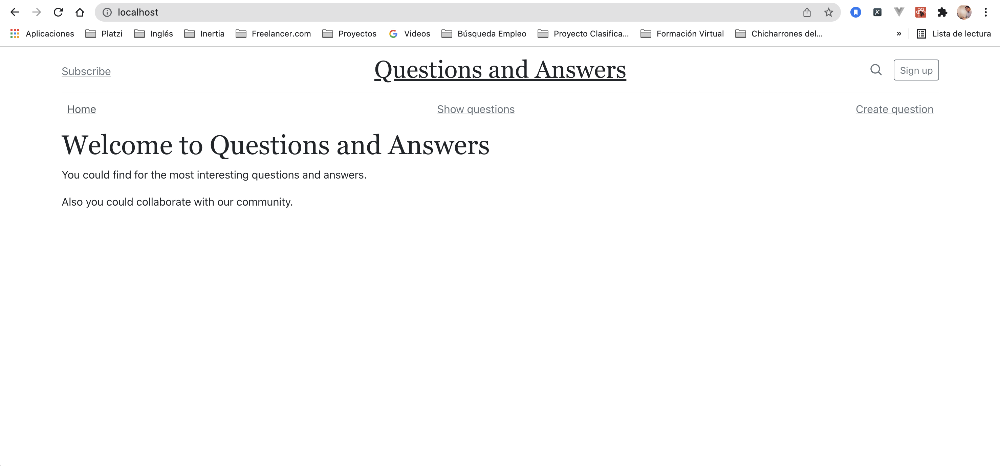
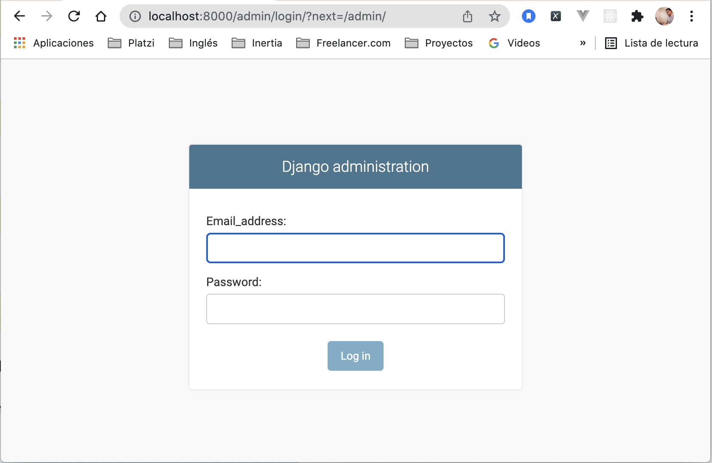
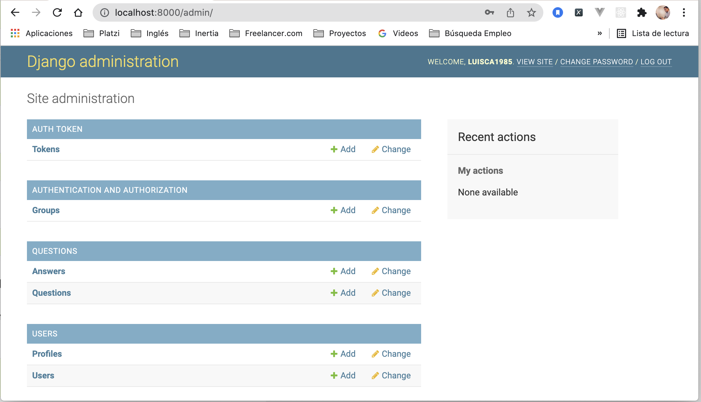

# Questions and Answers

## Prerrequisitos
- [Python3.10](https://www.python.org/downloads/)
- [Node](https://nodejs.org/es/download/)
- [Docker](https://docs.docker.com/get-docker/)

## Configuración Inicial
### Iniciar con Docker
Clonar el proyecto

```
git clone https://github.com/luisca1985/questions_and_answers.git
```

Ingresar a la carpeta del proyecto

```
cd questions_and_answers
```

### Crear el proyecto con Docker y Docker Compose
Crear el proyecto

```
docker-compose up --build -d
```
### Crear los modelos en las bases de datos de la API
Realizar la migración de los modelos

```
docker-compose run --rm server python manage.py migrate
```
## Ingresa a la página

```http
http://localhost
```




## Consola de Administración
### Crear el usurio de administración
Ingresa el siguiente comando para crear el usuario de administración
```
docker-compose run --rm server python manage.py createsuperuser
```

El sistema te solicitará los siguientes datos, necesarios para crear el usuario.
```
Email_address: <INGRESA_CORREO_ELECTRONICO>
Username: <INGRESA_USUARIO>
First name: <INGRESA_NOMBRE>
Last name: <INGRESA_APELLIDO>
Password: <INGRESA_CONTRASEÑA>
Password (again): <INGRESA_CONTRASEÑA_NUEVAMENTE>
Superuser created successfully.
```

### Ingresar a la consola de administración

```http
http://localhost:8000/admin
```
Se desplegará la ventana de inicio de sesión de la consola de administración, dentro de la cual debes ingresar el correo electrónico y contraseña del usuario de administración creado previamente.



Un vez ingreses a la consola de administración puedes gestionar la información del proyecto.


## Testing
Para correr los test utilizar:
```
docker-compose run --rm server pytest
```